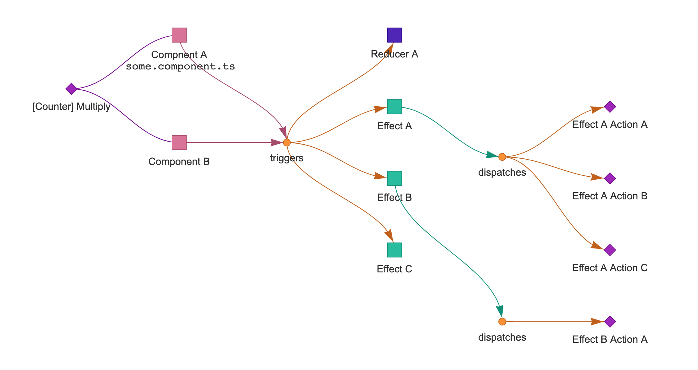

# ngrx-graph

## Next steps

- [x] read actions being dispatched by an effect
- [ ] draw first graph based on the given data
- [ ] plan simple web-ui

## Vision

We want to create a Tool that provides a beautiful graph displaying the journey of each action.
It should be displayed in which file an action is **created**, where it is **dispatched** and where it is **processed** (effect or reducer).
The user gets a documentation being always up to date. It is possible to identify effects that are too complex. Also best practices could be provided by ngrx-graph according to the recommendations given by the NgRx team (Good action hygiene).

## Design

Before starting implementing this tool there a a couple of questions to answer.

- How do we lookup actions?
- How do we build a dependency tree between Actions, Effects and Reducers?
- What information should the graph display?
- What view-modes should be provided initially?

### How do we lookup actions?

We can try extracting all information from AST.
The library [ts-morph](https://ts-morph.com/) could help here finding all references of an action.

There might be different strategies to find Actions:

- Vanilla NgRx Actions
- NgRx Ducks Actions

Both using the same Type-System but provide the action creators in different ways.

### How do we build a dependency tree between Actions, Effects and Reducers?

We need to organize all data in a graph.

#### Libraries

- [Mermaid](https://mermaid-js.github.io/mermaid/#/)
- [Vis.js](https://visjs.org/)
- [D3](https://observablehq.com/@d3/tidy-tree)

### What information should the graph display?

First example with a couple use cases. It is not meant to be complete.
For example there are Effects being not triggered by Actions dispatched from a component (see router actions).

### What view-modes should be provided initially?

- Graph View
- Table listing all actions
  - Grouped/Ordered by scope
